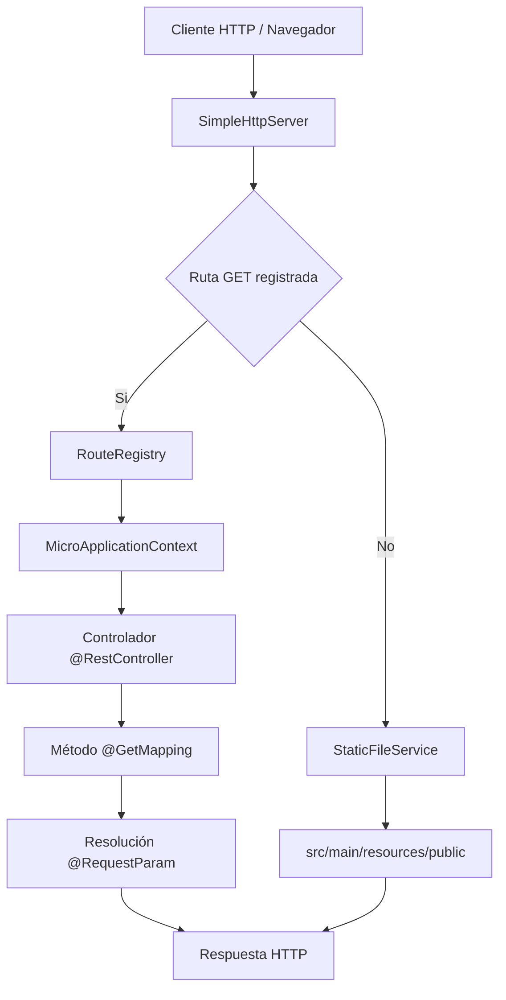
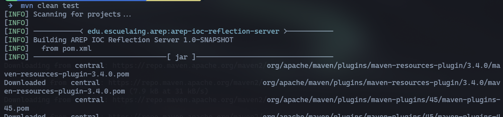
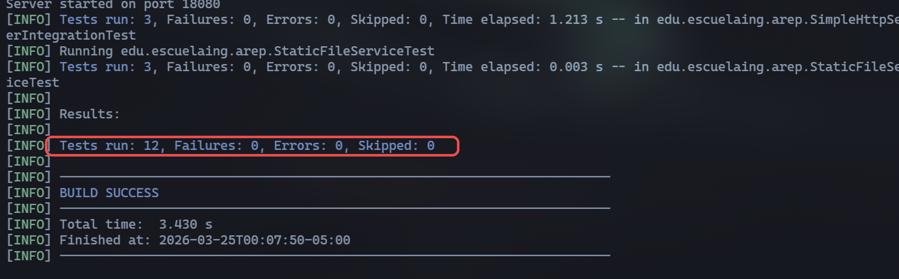
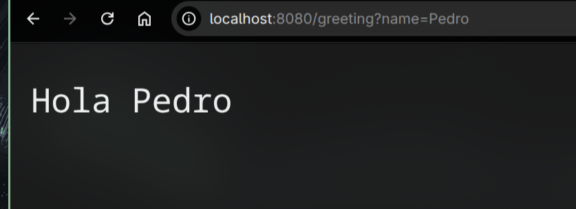
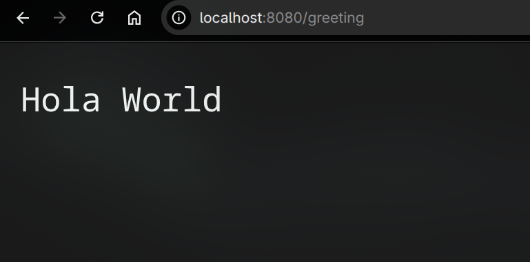
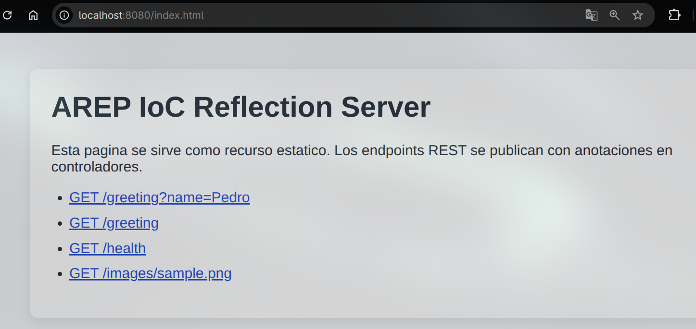
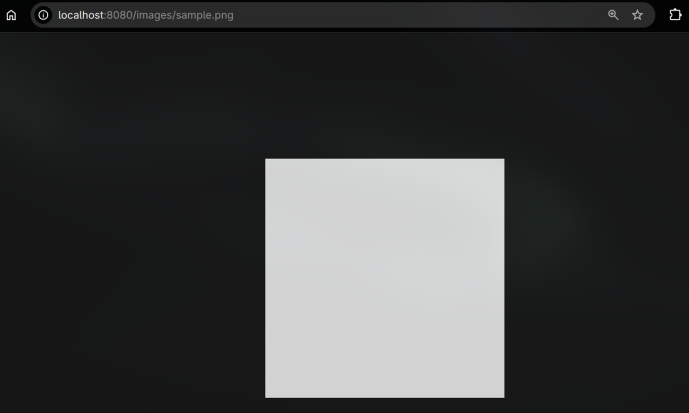

# AREP-IOC-Reflection-Server


> Servidor HTTP en Java con microframework IoC basado en reflexión y anotaciones para exponer servicios REST con `@RestController`, `@GetMapping` y `@RequestParam`.

---

## Tabla de contenido

- [AREP-IOC-Reflection-Server](#arep-ioc-reflection-server)
  - [Tabla de contenido](#tabla-de-contenido)
  - [Resumen](#resumen)
  - [Arquitectura y diseño](#arquitectura-y-diseño)
  - [Estructura del proyecto](#estructura-del-proyecto)
  - [Requisitos](#requisitos)
  - [Instalación y ejecución](#instalación-y-ejecución)
  - [Uso del microframework](#uso-del-microframework)
  - [Pruebas](#pruebas)
  - [Evidencia de funcionamiento](#evidencia-de-funcionamiento)
  - [Evidencia de despliegue en AWS](#evidencia-de-despliegue-en-aws)
  - [Cumplimiento de rúbrica](#cumplimiento-de-rúbrica)
  - [Autor](#autor)

---

## Resumen

Este proyecto implementa un prototipo de servidor de aplicaciones con los requerimientos del laboratorio:

- Servidor HTTP no concurrente.
- Entrega de archivos estáticos (`HTML`, `PNG`).
- Framework IoC para construir aplicaciones web desde POJOs.
- Detección automática de componentes por reflexión.
- Publicación de métodos REST con anotaciones.

El resultado es un servidor ejecutable y clonable que cumple estructura Maven, incluye pruebas automatizadas y documentación completa.

---

## Arquitectura y diseño



Componentes principales:

- `SimpleHttpServer`: ciclo de vida del socket, parsing básico de requests y envío de respuestas HTTP.
- `MicroApplicationContext`: carga de controladores, reflexión de métodos y registro de rutas.
- `ClasspathScanner`: exploración del classpath por paquete para detectar clases anotadas con `@RestController`.
- `RouteRegistry`: mapa de rutas GET a handlers.
- `StaticFileService`: resolución de recursos estáticos locales y desde classpath.
- `BeanContainer`: registro de instancias de controladores.

Decisiones de diseño relevantes:

- Separación de responsabilidades por capa (HTTP, IoC, routing, static files).
- Tipos inmutables para request y respuesta HTTP.
- Manejo explícito de errores por códigos HTTP (`404`, `405`, `500`).

---

## Estructura del proyecto

```text
AREP-IOC-Reflection-Server/
├── pom.xml
├── .gitignore
├── README.md
├── resources/
│   └── moodle.md
└── src/
    ├── main/
    │   ├── java/edu/escuelaing/arep/
    │   │   ├── Main.java
    │   │   ├── annotations/
    │   │   │   ├── RestController.java
    │   │   │   ├── GetMapping.java
    │   │   │   └── RequestParam.java
    │   │   ├── http/
    │   │   │   ├── HttpRequest.java
    │   │   │   └── HttpResponse.java
    │   │   ├── ioc/
    │   │   │   ├── BeanContainer.java
    │   │   │   ├── ClasspathScanner.java
    │   │   │   └── MicroApplicationContext.java
    │   │   ├── server/
    │   │   │   ├── RouteHandler.java
    │   │   │   ├── RouteRegistry.java
    │   │   │   ├── SimpleHttpServer.java
    │   │   │   └── StaticFileService.java
    │   │   └── app/controllers/
    │   │       ├── GreetingController.java
    │   │       └── HealthController.java
    │   └── resources/public/
    │       ├── index.html
    │       ├── styles.css
    │       └── images/sample.png
    └── test/java/edu/escuelaing/arep/
        ├── HttpRequestTest.java
        ├── MicroApplicationContextTest.java
        ├── StaticFileServiceTest.java
        └── SimpleHttpServerIntegrationTest.java
```

---

## Requisitos

- Java 17 o superior.
- Maven 3.x.
- Git.

---

## Instalación y ejecución

1. Clonar el repositorio:

```bash
git clone https://github.com/USER/AREP-IOC-Reflection-Server.git
cd AREP-IOC-Reflection-Server
```

2. Compilar y ejecutar pruebas:

```bash
mvn clean test
```

3. Empaquetar:

```bash
mvn clean package
```

4. Ejecutar servidor (escaneo automático del paquete de controladores):

```bash
java -cp "target/classes:target/dependency/*" edu.escuelaing.arep.Main
```

5. Ejecutar indicando clase específica (modo de carga explícita):

```bash
java -cp "target/classes:target/dependency/*" edu.escuelaing.arep.Main edu.escuelaing.arep.app.controllers.GreetingController
```

---

## Uso del microframework

Anotaciones soportadas:

- `@RestController`: marca una clase como componente web.
- `@GetMapping("/ruta")`: publica un endpoint GET.
- `@RequestParam(value="name", defaultValue="World")`: extrae parámetros query.

Ejemplo implementado:

```java
@RestController
public class GreetingController {
    @GetMapping("/greeting")
    public String greeting(@RequestParam(value = "name", defaultValue = "World") String name) {
        return "Hola " + name;
    }
}
```

Endpoints de ejemplo:

- `http://localhost:8080/greeting?name=Pedro`
- `http://localhost:8080/greeting`
- `http://localhost:8080/health`
- `http://localhost:8080/index.html`
- `http://localhost:8080/images/sample.png`

---

## Pruebas

Este proyecto incluye pruebas unitarias e integración para cubrir:

- Parsing de query params.
- Carga de controladores por classpath (`@RestController`).
- Registro de rutas por `@GetMapping`.
- Resolución de `@RequestParam` con y sin valor por defecto.
- Entrega de recursos estáticos (`HTML`, `PNG`).
- Flujo real servidor HTTP + endpoints.

Ejecución:

```bash
mvn clean test
```

Resultado esperado:

- Build success.
- Todas las pruebas en verde.

---

## Evidencia de funcionamiento

Sección preparada para que insertes capturas clave de alta calidad.

1) Evidencia de pruebas automatizadas (`mvn clean test`):




2) Endpoint REST con parámetro (`/greeting?name=Pedro`):



3) Endpoint REST con valor por defecto (`/greeting`):



4) Recurso estático HTML (`/index.html`):



5) Recurso estático PNG (`/images/sample.png`):



---

## Evidencia de despliegue en AWS

La rúbrica exige evidencia de despliegue correcto en AWS. Dejo la sección para anexar evidencia al finalizar tu despliegue:

1) Instancia EC2 operativa:


2) Servidor ejecutándose en instancia remota:


3) Consumo del endpoint desde cliente externo:


4) Evidencia de static file en AWS:


---

## Cumplimiento de rúbrica

| Criterio | Estado |
| :--- | :---: |
| `@RestController` implementado | Cumplido |
| Exploración de classpath y carga automática | Cumplido |
| `@GetMapping` implementado | Cumplido |
| `@RequestParam` implementado | Cumplido |
| Requisitos funcionales adicionales | Cumplido |
| Atributos de calidad y diseño razonable | Cumplido |
| README con arquitectura, ejecución y pruebas | Cumplido |
| Pruebas automatizadas | Cumplido |
| Repositorio clonable y ejecutable | Cumplido |

Notas de entregables:

- El repositorio incluye `.gitignore`, `README.md`, `pom.xml` y estructura Maven.
- `target/` está excluido en `.gitignore`.
- No se incluyen carpetas de build innecesarias en el árbol fuente.

---

## Autor

Sergio Andrey Silva Rodriguez  
Systems Engineering Student  
Escuela Colombiana de Ingeniería Julio Garavito
